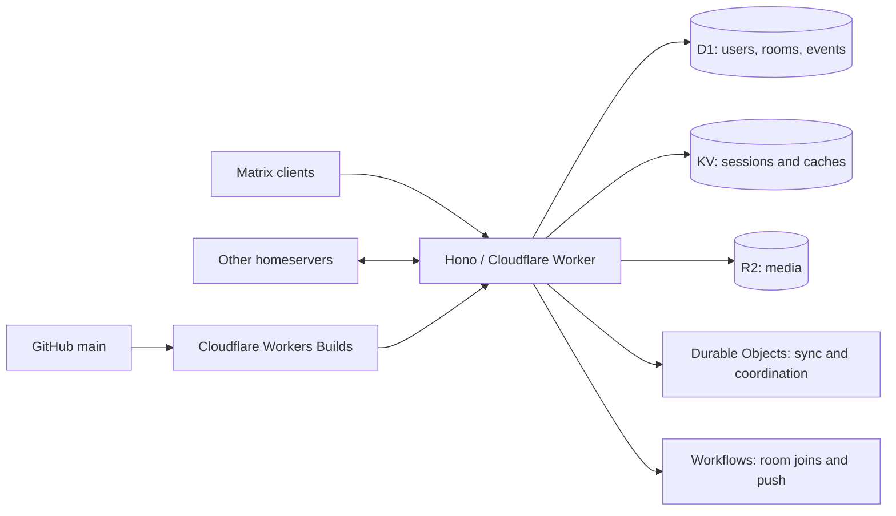

# Matrix on Cloudflare Workers

[](https://github.com/koljasagorski/matrix-workers/actions/workflows/security.yml)

A self-hosted Matrix homeserver implemented in TypeScript and Hono, running on Cloudflare Workers with D1, KV, R2, Durable Objects and Workflows.

**Homeserver:** [m.sgr.ski](https://m.sgr.ski) · **Administration:** [m.sgr.ski/admin](https://m.sgr.ski/admin) · **Status:** [health](https://m.sgr.ski/health)

This is an experimental implementation, derived from [nkuntz1934/matrix-workers](https://github.com/nkuntz1934/matrix-workers). It is not Synapse or the Rust Tuwunel server. Implemented endpoints are not evidence of complete Matrix specification compliance or an independent security audit. Use it with that limitation in mind.

## Connect

In Element Web, Element X or another Matrix client, choose a custom homeserver and enter:

```text
https://m.sgr.ski
```

Accounts have IDs such as `@alice:m.sgr.ski`. Public and guest registration are disabled by default. An administrator creates accounts in the admin dashboard. The root URL redirects to that dashboard; this repository does not bundle a chat client.

Classic login and registration issue non-expiring access tokens unless the client explicitly requests refresh support with `refresh_token: true`. This keeps Element Desktop's password-login sessions valid until logout, device removal or account deactivation. Clients that opt in receive one-hour access tokens and rotating refresh tokens valid for seven days. Previously issued tokens retain their original expiry; sign in again after deploying this change to create a persistent desktop session.

The server publishes client and federation discovery at `/.well-known/matrix/client` and `/.well-known/matrix/server`. Federation uses HTTPS on port 443.

Remote room aliases, room previews and joins support room versions 10–12, including version 12 room IDs without a server name. Use a room alias or supply `via` / `server_name` hints for an unknown room ID. Joins sign the federation handshake, validate event signatures and authorization dependencies, and import the room state in a D1 transaction before returning success. Accepted handshakes are temporarily cached for retry if importing fails. Historical signing keys can be retrieved from the trusted `matrix.org` key notary when an origin is offline or has retired a key.

Device key queries, one-time key claims, encrypted room events and to-device messages are routed to remote homeservers. Outbound federation uses the Durable Object queue with signed requests and retries.

Backward `/messages` pagination fetches remote history on demand, in pages of up to 20 historical events. It validates signatures, authorization chains and visibility at the time of each event. User-scoped history cursors and event caches expire after seven days; historical events never overwrite live state or generate notifications. Element X and classic clients receive an initial page of up to 10 remote history events when their local timeline is incomplete, plus a cursor for further pagination. Retrieving encrypted history does not supply its decryption keys: those must be shared by clients or imported from the previous account. Full Matrix conformance remains outside this tested repair.

Device verification uses separate room, device-message and key-change cursors. Pending direct messages wake long polls immediately, and clients receive persisted verification signatures when querying device and cross-signing keys. Account deactivation and single/bulk device removal require the authenticated account’s current password; missing passwords and unsupported authentication methods are rejected before any mutation. Device removal clears the Durable Object/KV key stores and revokes that device’s tokens.

## What is included

| Area | Implementation |
| --- | --- |
| Accounts | Password login, devices, access/refresh tokens, profiles, admin dashboard |
| Messaging | Rooms, membership, messages, classic sync and sliding sync |
| Encryption support | Device keys, one-time keys, cross-signing and encrypted key backups; encryption happens in clients |
| Federation | Server discovery, signing keys and server-to-server endpoints |
| Media and search | R2 uploads/downloads and D1 FTS5 search |
| Optional integrations | External OIDC, application services, push delivery, LiveKit/TURN and email verification |

Voice/video, email sending, direct APNs delivery, AI, analytics and browser rendering require additional bindings or credentials. They are **not enabled** in this deployment. See [deployment and operations](DEPLOYMENT.md).

## Local development

Use Node.js 22.12 or newer (the project and CI use Node 22).

```bash
git clone https://github.com/koljasagorski/matrix-workers.git
cd matrix-workers
npm ci
npm run db:migrate:local
npm run admin:create -- admin --local
npm run dev
```

Open `http://localhost:8787/admin`. The admin creation command saves the generated password in `.local/admin-local.json` with restrictive file permissions. That directory is ignored by Git. For a local client, enter `http://localhost:8787` explicitly: the committed discovery configuration names the production domain.

| Command | Purpose |
| --- | --- |
| `npm run dev` | Local Workers runtime with local storage |
| `npm run check` | Type check, regression tests, dependency audit and deployment dry run |
| `npm test` | Authentication, token lifetime, migrations and search regression tests |
| `npm run types` | Regenerate Cloudflare binding/runtime types after config changes |
| `npm run db:migrate:local` | Apply pending migrations locally |
| `npm run db:migrate` | Apply pending migrations to the production D1 database |
| `npm run deploy` | Apply production migrations, then deploy the Worker |
| `npm run smoke -- https://m.sgr.ski` | Check discovery, health, login flows, closed registration and server keys |
| `npm run admin:create -- admin --remote` | Create an initial admin using authenticated Cloudflare CLI access |

## Deployment from GitHub

Cloudflare Workers Builds is connected to this repository's `main` branch:

1. A push to `main` starts a Cloudflare build through the native GitHub integration.
2. Dependencies install from `package-lock.json` using `npm ci`.
3. `npm run check` must pass.
4. `npm run deploy` applies pending D1 migrations and deploys to `m.sgr.ski`.

GitHub Actions independently checks changes and runs CodeQL. Dependabot proposes weekly npm and GitHub Actions updates; updates are reviewed and merged before they reach production. Pull requests do not deploy to production.

The Cloudflare build integration holds its deployment credentials. No Cloudflare deployment secret is needed in GitHub, and no Cloudflare API token belongs in the repository. Resource IDs and the domain in `wrangler.jsonc` are specific to this installation; forks need their own resources.

## Architecture



- `src/api/`: Matrix, federation and administration endpoints.
- `src/services/`: persistence, event authentication, state resolution and integrations.
- `src/durable-objects/`: room, sync, federation, admin, key, push and rate-limit coordination.
- `src/workflows/`: durable background operations; two are bound in the deployed configuration.
- `migrations/`: ordered SQL migrations tracked by D1.
- `tests/`: regression tests for the maintenance fixes.
- `worker-configuration.d.ts`: generated Cloudflare types.

## Maintenance changes

The October 2026 refresh updates Hono, Wrangler, TypeScript and Vitest, removes unused UUID packages, and replaces manually duplicated platform types with generated types. It also closes a passwordless login path, enforces the admin registration setting, checks token expiration/deactivated users, rejects refresh after logout, removes authentication-token debug logging and repairs the event search index.

The federation repair also requires authentication on v2 federation endpoints, checks room access before returning private state, removes password logging from key uploads, rejects placeholder SSO/token reauthentication, enforces OAuth access-token expiry and session-bound refresh rotation, rejects unsigned JWT introspection, sandboxes uploaded media, and rate-limits browser login routes. Password-based key replacement remains available; the unimplemented SSO reset shortcuts return an explicit error.

The regression tests cover alias discovery, room previews, signed joins for versions 10–12, invalid signatures/templates, atomic imports, incoming/outgoing encrypted events, remote device keys, to-device delivery, queue retries and the reproduced security issues. The test suite covers these changes; it is not a full Matrix conformance suite. Upstream contains experimental and incomplete endpoints, so broader federation, OIDC and client interoperability should be validated before expanding usage.

## License

[MIT](LICENSE). Original authorship and license are retained.
